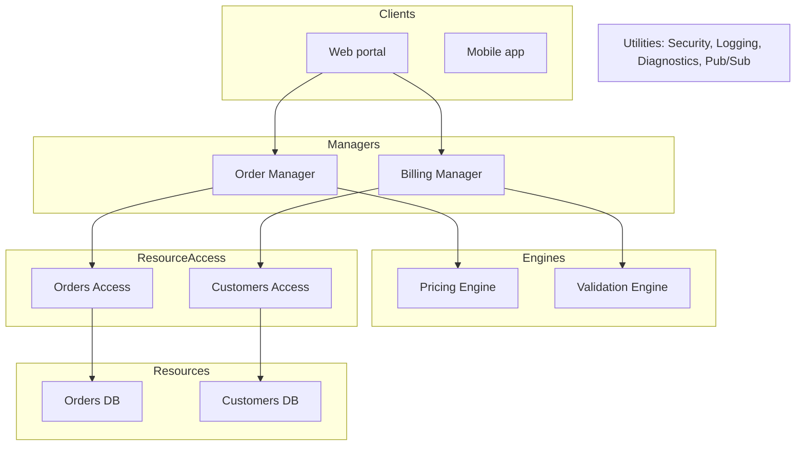
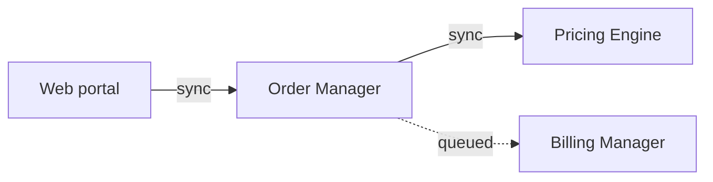
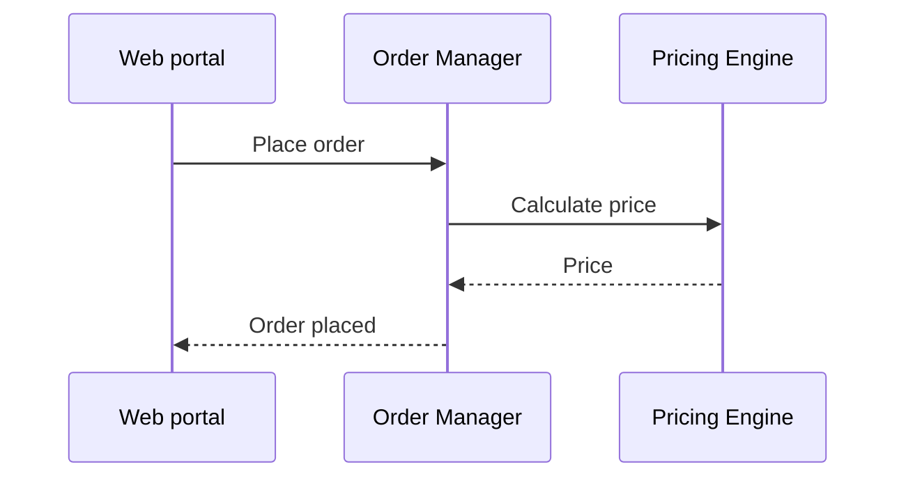

# Architecture Plan Document — Template

This is the output contract for the right-software skill. Produce the plan document with these sections in this order. Fill every section. Where information is missing, ask the user or record the assumption in Open Risks.

## Diagram Conventions

Every diagram is a text block. Use Mermaid blocks with a compact ASCII fallback.

Never generate SVG files. Never embed images. Never reference media files. Terminal-only readers and plain editors must see the full structure in text.

### Static architecture

Use a Mermaid `flowchart TB` with one subgraph per layer, or the ASCII layer table below.



ASCII fallback:

```
Clients         [ Web portal ]   [ Mobile app ]   [ Admin app ]
Managers        [ Order manager ] [ Billing manager ]
Engines         [ Pricing ]      [ Validation ]   [ Tax ]
ResourceAccess  [ Orders ]       [ Customers ]    [ Payments ]
Resources       [ Orders DB ]    [ Customers DB ] [ Payment gateway ]
  (right side)  Utilities bar:  [ Security ] [ Logging ] [ Diagnostics ] [ Pub/Sub ]
```

### Call chains

One Mermaid `flowchart` per core use case. Synchronous calls use solid edges. Dashed edges mark queued calls.



ASCII fallback:

```
Web portal -> Order Manager (sync)
Order Manager -> Pricing Engine (sync)
Order Manager => Billing Manager (queued)
```

### Sequence diagrams

One Mermaid `sequenceDiagram` per core use case.



ASCII fallback (numbered steps):

```
1. Web portal -> Order Manager: Place order
2. Order Manager -> Pricing Engine: Calculate price
3. Pricing Engine -> Order Manager: Price
4. Order Manager -> Web portal: Order placed
```

## 1. System Overview

One paragraph. The system in business terms. What it does and for whom. State the assumptions about scope.

## 2. Glossary

Domain terms with definitions. The Method requires a shared vocabulary. Define every term the plan uses.

## 3. Core Use Cases

List the core use cases. Two to six. Each entry has:

- Name.
- Description as an abstraction of other use cases.
- Statement that every known use case is a variation of one of these.

## 4. Volatilities List

The unstructured list from the volatility assessment. Each entry has:

- The volatility.
- Its axis: same customer over time, or different customers at the same time.
- Evidence from the probes, the solution scrubbing, or the competitor test.

Do not rank or score the entries. Do not design yet.

## 5. Static Architecture

The component graph. Per component:

- Name (two-part PascalCase, type suffix).
- Type: Client, Manager, Engine, Resource Access, Resource, Utility.
- Encapsulated volatility.
- Dependencies (downward only).

Include the static architecture diagram per the Diagram Conventions.

## 6. Communication Rules

State the rules the design honors. List every relaxation of the closed architecture and justify each one. Note every Manager-to-Manager queue. Note every shared Engine.

## 7. Call Chains

One call chain per core use case. Include the flowchart and the ASCII fallback per the Diagram Conventions. Show synchronous and queued edges.

## 8. Design Validation

For each core use case:

- The sequence diagram and ASCII fallback.
- The symmetry note. State whether call patterns repeat across use cases.
- The Design Don'ts checklist result.

State the iteration count if you revised the design during validation.

## 9. Open Risks

List:

- Unencapsulated volatility.
- Assumptions the user confirmed.
- Unresolved questions.
- Relaxations that may not hold.

This section is the hand-off to project design. Project design itself is out of scope for this skill.
